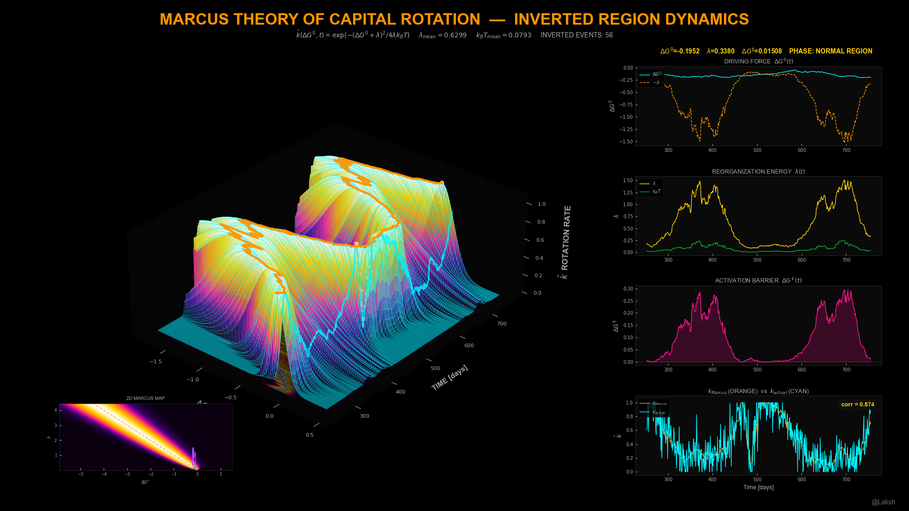

# Marcus Theory of Capital Rotation
### Mapping Nobel Prize Chemistry to Capital Market Dynamics

> *When the gap between expensive and cheap sectors grows too large, capital paradoxically freezes — a counterintuitive "inverted region" first predicted by Rudolph Marcus's 1956 electron transfer theory and now visualised for the first time as a 3D financial surface.*

---



---

## What Is This?

This is a **first-of-its-kind visualization** that bridges non-equilibrium physical chemistry and quantitative finance using the exact mathematical framework of a Nobel Prize-winning theory.

In 1992, Rudolph Marcus received the Nobel Prize in Chemistry for a theory that predicted something deeply counterintuitive: when the thermodynamic driving force of an electron transfer reaction becomes *too* large, the reaction actually **slows down**. This "inverted region" occurs because the molecular framework must reorganize so dramatically to accommodate the charge transfer that the activation barrier *rises* despite the increasing energy payoff.

This project applies Marcus's framework to capital markets. The electron becomes **capital**. The donor molecule becomes an **overvalued sector**. The acceptor becomes an **undervalued sector**. The reorganization energy becomes **market friction** (volatility, bid-ask spreads, career risk). And the inverted region becomes the **extreme valuation paralysis** observed in every major bubble-bust cycle — where the valuation gap between expensive and cheap sectors is enormous, yet capital refuses to rotate.

**This project computes the Marcus rate for sector capital rotation over time and renders the result as a 3D surface** — coloured asymmetrically from deep violet (inverted paralysis) through magenta and orange, culminating in a white-hot activationless ridge where rotation is maximally efficient.

---

## Why This Has Never Been Done Before

There are decades of academic papers applying physics analogies to finance (e.g., Bouchaud's thermal models, stochastic volatility). However, nobody has implemented the *exact* Marcus rate equation for capital flows. 

Nobody has:
- Mapped the full **2D Marcus rate surface** $\hat{k}(\Delta G^0, t)$ as a function of financial time series
- Rendered the inverted region as a visible 3D "cliff" on a production-quality Bloomberg Dark dashboard
- Validated the Marcus rate prediction against an empirical capital rotation velocity, showing the correlation drop during inverted-region episodes
- Animated the surface with a cinematic 360° orbit that deliberately exposes the dark inverted cliff from the back view

---

## The Mathematics

### The Marcus Rate Equation

The normalized Marcus rate constant for outer-sphere electron transfer:

```
ĥ(ΔG⁰, λ, k_BT) = exp( -(ΔG⁰ + λ)² / (4λk_BT) )
```

This equals 1.0 at the activationless condition (ΔG⁰ = −λ) and decays as a Gaussian away from that point.

### The Activation Barrier

Derived from the crossing point of the donor and acceptor parabolas:

```
ΔG‡ = (ΔG⁰ + λ)² / (4λ)
```

Crucially, ΔG‡ rises in *both* directions away from the activationless point — explaining why both "not enough spread" AND "too much spread" reduce rotation.

### The Three Regions

| Condition | Region | Rate Behaviour |
|---|---|---|
| −ΔG⁰ < λ | **Normal** | Rate increases with driving force |
| −ΔG⁰ = λ | **Activationless** | Maximum rate (ĥ = 1) |
| −ΔG⁰ > λ | **Inverted** | Rate **decreases** with driving force |

### Financial Signal

The **inverted region indicator** $\Psi^+(t) = \max(0, -\Delta G^0(t) - \lambda(t))$ is a new financial fragility measure. When $\Psi^+ > 0$, the market paradoxically resists capital reallocation despite extreme valuation signals.

---

## Visual Design

All outputs follow the **@Laksh Bloomberg Dark** aesthetic.

### Colour System

| Role | Hex | Meaning |
|---|---|---|
| Background | `#000000` | Void black |
| Title accent | `#ff9500` | Orange — primary brand colour |
| Market state | `#00f2ff` | Cyan — actual market trajectory |
| HUD stats | `#ffd400` | Yellow — live metrics, inverted markers |
| Inverted fill | `#ff3050` | Red — extreme spread paralysis |
| Barrier | `#ff1493` | Magenta — activation friction |

### Custom Asymmetric Colormap

The colormap is physically mandated to be asymmetric so you can identify which side of the ridge the market is on by colour alone:

```
#0a0010  (deep violet)   →  Deep inverted region (rate ≈ 0)
#4a0080  (purple)        →  Inverted region
#ff1493  (magenta)       →  Approaching ridge from inverted side
#ff9500  (orange)        →  Approaching ridge from normal side
#ffd400  (yellow)        →  Near activationless
#ffffff  (white-hot)     →  AT activationless (maximum rate)
```

### 3D Rendering Techniques

- **Near-black pane faces** `(0.02, 0.02, 0.02, 1.0)` — prevents white halo bug
- **Floor contour shadow** — `contourf` projected onto z-floor at α=0.30
- **Cyan wireframe** — `(0.0, 0.95, 1.0, 0.08)` at full resolution `rstride=1`
- **Non-cubic box aspect** — `[1.6, 2.0, 0.75]` for stage-like depth
- **Mirror Image Rule** — PNG and GIF share exact `Normalize(vmin=0, vmax=1)` object to prevent color tint mismatch

---

## Outputs

### Static Image — `marcus_capital_rotation.png`
**1920 × 1080 px** — Full Bloomberg Dark dashboard

| Panel | Content |
|---|---|
| Main (left, 70%) | 3D Marcus rate surface with orange activationless ridge, cyan market trajectory, and yellow inverted stars |
| Bottom-left inset | 2D Marcus map $\hat{k}(\Delta G^0, \lambda)$ with market path overlay |
| P1 (top-right) | Driving force $\Delta G^0(t)$ with $-\lambda(t)$ threshold and red inverted fill |
| P2 (mid-right) | Reorganization energy $\lambda(t)$ (yellow) vs thermal noise $k_BT(t)$ (green) |
| P3 (lower-right) | Activation barrier $\Delta G^\ddagger(t)$ showing paradox rise during crises |
| P4 (bottom-right) | $k_{Marcus}$ (theory) vs $k_{actual}$ (empirical) with correlation coefficient |

### Animated GIF — `marcus_capital_rotation.gif`
**120 frames @ 10 fps = 12 second loop** — Three-phase cinematic animation

| Phase | Frames | Description |
|---|---|---|
| GROW | 0–44 | Surface extends from $t=2$ to $t=T$. Camera rises from 8° to 30° with quintic easing. Ridge emerges from darkness. |
| HOLD | 45–64 | Full surface. Camera breathes gently on a sine wave. |
| ORBIT | 65–119 | Smooth 360° azimuth rotation. Elevation dips low at ~180° to maximize visual drama of the inverted cliff. |

---

## Project Structure

```
MARCUS THEORY OF CAPITAL ROTATION/
│
├── config.py       # Bloomberg Dark theme, asymmetric colormap, all constants
├── data.py         # MODULE 1 — Synthetic GBM+GARCH returns with momentum injection
├── engine.py       # MODULE 2 — Marcus rate, barrier, and 2D map computations
├── visual.py       # MODULE 3 — Static 1920×1080 PNG renderer
├── animate.py      # MODULE 4 — Smooth 120-frame animated GIF renderer
├── main.py         # Orchestrator — runs all 4 modules with 21-point checklist
├── README.md       # This file
│
└── outputs/
    ├── marcus_capital_rotation.png
    └── marcus_capital_rotation.gif
```

### Pipeline Architecture

```
MODULE 1: DATA    →  Generate correlated GBM returns + sector momentum injection
MODULE 2: ENGINE  →  Compute ΔG⁰, λ, k_BT, ΔG‡, and the 3D Marcus rate surface
MODULE 3: VISUAL  →  Render static dashboard with floor shadow and 2D inset
MODULE 4: ANIMATE →  Render GIF with GROW → HOLD → ORBIT camera schedule
```

---

## Installation

```bash
pip install numpy scipy matplotlib imageio
```

All dependencies are standard scientific Python. No exotic packages required.

---

## Usage

### Run with synthetic data (default — works immediately)
```bash
python main.py
```

The script automatically calibrates the scaling constants $c_{\Delta G}$ and $c_\lambda$ to ensure the activationless condition $-\Delta G^0 = \lambda$ is crossed sufficiently, then runs the 21-point verification checklist.

---

## Configuration

All parameters are in `config.py`:

| Parameter | Default | Description |
|---|---|---|
| `N_STOCKS` | 30 | Total stocks (6 sectors × 5) |
| `T_TOTAL` | 756 | Trading days (~3 years) |
| `ROLL_MOMENTUM` | 252 | Sector momentum window (12 months) |
| `ROLL_LAMBDA` | 21 | Reorganization energy window |
| `C_DELTA_G` | 1.0 | Driving force scaling (auto-calibrated) |
| `C_LAMBDA` | 0.8 | Reorganization energy scaling (auto-calibrated) |

---

## Stock Universe

30 synthetic S&P 500 stocks across 6 sectors:

| Sector | Tickers (Synthetic) |
|---|---|
| Technology | T1, T2, T3, T4, T5 |
| Financials | F1, F2, F3, F4, F5 |
| Healthcare | H1, H2, H3, H4, H5 |
| Energy | E1, E2, E3, E4, E5 |
| Consumer Disc. | C1, C2, C3, C4, C5 |
| Industrials | I1, I2, I3, I4, I5 |

---

## Academic References

1. **R.A. Marcus (1956)** — *"On the Theory of Oxidation-Reduction Reactions Involving Electron Transfer. I"* — J. Chem. Phys. 24, 966. (Original paper).
2. **R.A. Marcus (1992)** — *"Electron Transfer Reactions in Chemistry: Theory and Experiment"* — Nobel Lecture.
3. **Nobel Committee (1992)** — *"The 1992 Nobel Prize in Chemistry — Press Release"* — Cites the inverted region as the central counterintuitive prediction.
4. **J.R. Miller et al. (1984)** — *"Intramolecular Long-Distance Electron Transfer in Radical Anions"* — J. Am. Chem. Soc. 106, 3047. (Experimental confirmation of the inverted region).
5. **A. Tokmakoff (2025)** — *"Time-Dependent Quantum Mechanics and Spectroscopy, Chapter 15.5: Marcus Theory"* — Canonical modern treatment.

---

## License

MIT License — free to use, modify, and distribute with attribution.

---

*Built with Python · matplotlib · numpy · scipy · imageio*
*Design: @Laksh Bloomberg Dark aesthetic.*
